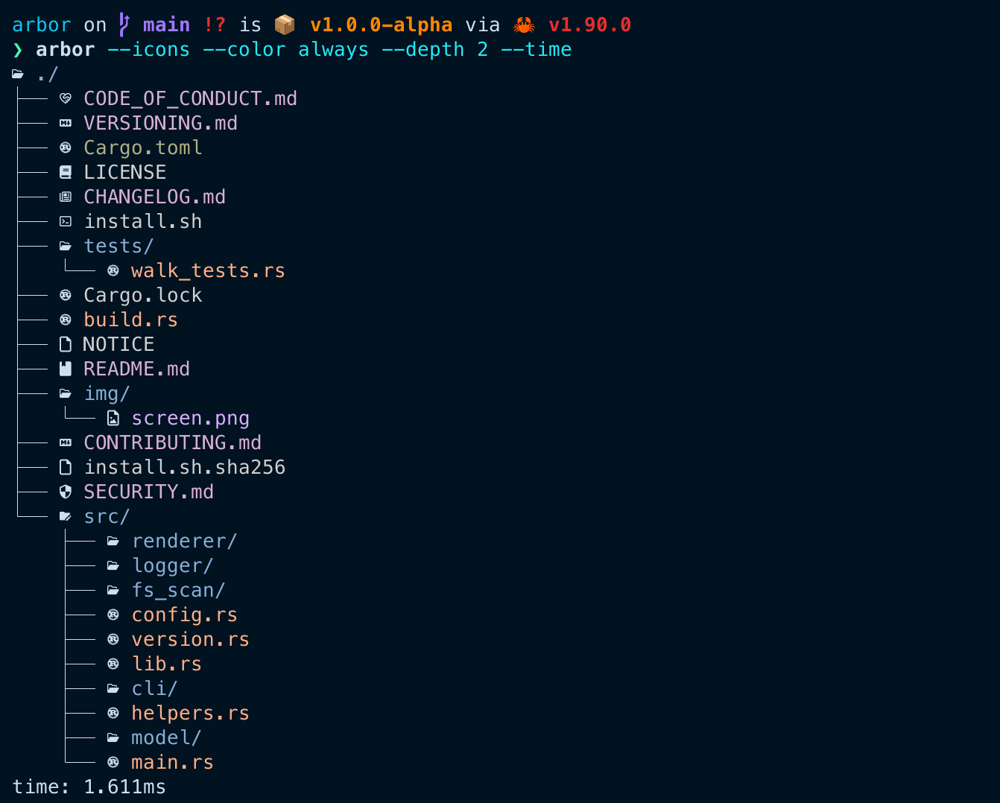

# Arbor - Smart Tree 🌴
_by Benjamin Grolleau & Angelo Tunney_


Arbor is a modern and smart reimplementation of the traditional tree command. Its goal is to provide developers with a more intuitive and visually clear way to explore project structures. Unlike the classic version, Arbor introduces several improvements such as configurable depth levels for better readability, colorized output to distinguish files and directories at a glance, and automatic filtering of files or folders ignored by Git (based on the .gitignore file). It can also display the Git status of files, showing whether they are untracked, modified, staged for commit, or stashed. Arbor is written in Rust.



## ⚙️ Installation
To make your life easier, Arbor can be installed in several ways depending on your preferences and setup.

### 🌍 One-liner (auto-detects your OS and architecture) — Recommended
```bash
curl -fsSLO https://raw.githubusercontent.com/Grolleau-Benjamin/arbor/v1.0.0-alpha/install.sh
curl -fsSLO https://raw.githubusercontent.com/Grolleau-Benjamin/arbor/v1.0.0-alpha/install.sh.sha256
sha256sum -c install.sh.sha256 && bash install.sh
```
This command automatically detects your platform and installs the correct prebuilt binary in /usr/local/bin.

### 🦀 Using Cargo (build from source)
If you already have Rust and Cargo installed:
```
cargo install --git https://github.com/Grolleau-Benjamin/arbor --tag v1.0.0-alpha --locked
```

or manually:
```bash
git clone https://github.com/Grolleau-Benjamin/arbor
cd arbor
cargo build --release
sudo cp ./target/release/arbor /usr/local/bin
```

### 📦 Direct download (manual installation)
1. Visit the [Release page](https://github.com/Grolleau-Benjamin/arbor/releases).
2. Download the archive corresponding to your system (e.g. arbor-v1.0.0-alpha-x86_64-apple-darwin.tar.gz).
3. Extract it and move the binary somewhere in your PATH, for example:
  ```bash
  sudo mv arbor /usr/local/bin && source ~/.zprofile
  ```

  Then verify it works:
  ```bash
  arbor --version
  ```

## 🚀 Run in development
You can run *Arbor* directly from source with Cargo:
```bash
cargo run -- [Options]
```

Example:
```bash
cargo run -- --depth 2 --color always --icons --git
```

This will display the directory tree up to depth 2, with colors, icons, and Git status indicators.

## 🧪 Run tests
All integration tests are located in `./tests/` directory while unit tests are side by side to the file.

To run them:
```bash
cargo test
```

## 🧰 Build the binary
To build the project in release mode:
```bash
cargo build --release
```

The compiled binary will be located in:
```
./target/release/arbor
```

You can then run it directly:
```bash
./target/release/arbor [Options]
```

## 🦀 Cli Usages
You can display all available arguments using:
```bash
cargo run -- --help
```

## 🧹 Code Quality & Pre-commit Hooks
Arbor uses pre-commit to automatically enforce code quality and formatting rules before each commit. It ensures that every commit respects Rust’s formatting and linting standards.

### 🧩 Prerequisites
Install pre-commit using one of the following methods:

```shell
# macOS
brew install pre-commit

# Linux
sudo apt install pre-commit

# With a local Python environment
uv add --dev pre-commit
# or
poetry add --dev pre-commit
```

### ⚙️ Install
Once installed, enable the hooks:
```shell
pre-commit install
```

### 🧪 Run manually
You can manually run all hooks on the repository:
```
pre-commit run --all-files
```

### 🧭 Current state

Arbor is currently in active development.
All CLI options are **planned**, but some are not yet implemented.

| Option | Status | Description |
|--------|---------|-------------|
| `--show-gitignored` | ✅ | Show files listed in `.gitignore` (ignored by default) |
| `--show-hiddens` | ✅ | Include hidden files and directories (starting with `.`) |
| `--color <Auto\|Always\|Never>` | ✅ | Colorize the output (directories, files, others) |
| `--icons` | ✅ | Add icons for known file types and directories |
| `--depth <N>` | ✅ | Limit the displayed depth of the tree |
| `--git` | 🕓 | Display Git status indicators (modified, staged, untracked, etc.) |
| `--git-branch` | 🕓 | Show the current Git branch name next to the root |
| `--json` | ✅ | Output the tree as a JSON structure |
| `--count` | ✅ | Print only the number of files and directories |
| `--time` | ✅ | Measure and display execution time |
| `--verbose` | ✅ | Enable detailed logging |

## 🤝 Contributing
Contributions, issues, and feature requests are welcome!
Feel free to open a [pull request](https://github.com/Grolleau-Benjamin/arbor/pulls).

## 👥 Contributors

<table align="center">
  <tr>
    <td align="center">
      <a href="https://github.com/Grolleau-Benjamin">
        <br/>
        <sub><b>Benjamin Grolleau</b></sub>
      </a>
    </td>
    <td align="center">
      <a href="https://github.com/angelo-tny">
        <br/>
        <sub><b>Angelo Tunney</b></sub>
      </a>
    </td>
  </tr>
</table>

## 📜 License
Licensed under the **Apache-2.0** License.
See [LICENSE](./LICENSE) for more information.
